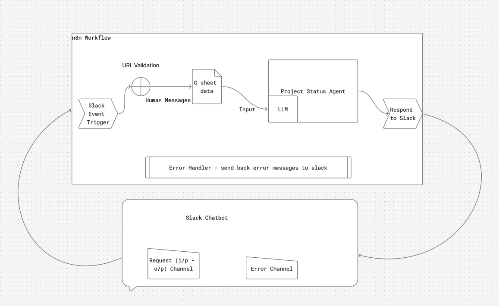

# Slack-Project-Status-chatbot
This workflow demonstrates the AI product architecture and how to enable controlled executions on non deterministic AI distributed system by setting the right guardrails.

# Problem Statement 
As a TPM the manager has to gather project status from various stakeholders and plan on any risk mitigations. It is essential that all risks are highlighted well ahead in time and these actions are to be taken for various accounts/projects/program the TPM is responsible for. While these tasks of gathering details can be resolved by AI workflows understanding the different data sources and building an efficient workflow is crucial while ensuring the results are reliable. 

# Goal
We will address two major aspects while building AI Products:
  1. A Production scale solution usually spans among different systems/ environments , How to handle such distributed systems?  As a PM/TPM how important is the understanding of a good system design and AI architecutre enables a smoother development and deployment. (A clear and bigger picture).
  2. Solution itself demonstrates the ability of an agentic workflow to assist PM/TPM in their day to day tasks by reducing the delay in gathering information and improving the efficiency of decision making tasks.

# Solution 
Platforms used -* n8n and slack *  for this workflow. Please follow the set up instruction provided in Setup_Instructions.md
We will Build a production-style Slack Project Status Chatbot in n8n: ingest Slack events, validate requests, fetch and format Google Sheet
project data, generate a structured status response using OpenAI, and ship with guardrails plus error alerts.

# Demo 
Path : assets/Slack Project Status Chat bot.mp4
link: 
# System Design
Path: assets/SystemDesign.png

# Setup_ Instructions

# Scaling Strategies 

     
